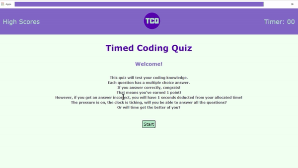

# Timed Coding Quiz
This is an interactive quiz, web application.
It is timed, has 5 questions, and records high scores at the end. 

## Description
We begin with a short explanation of the quiz, and a Start button that initialises the quiz, and its timer.
Once initialised we have a series of 5 questions, with 4 answers each.
Each answer has a radio button that when pressed, will give a sound FX depending on whether the answer is incorrect or correct.
If the correct answer is chosen, a 'correct' message will appear at the bottom of the page, and the player will be redirected (within
two seconds) to the next question.
If the answer is incorrect, an 'incorrect' message will show, and the correct answer will be revealed. The player will again be redirected
(within 2 seconds) to the next question.
Once all of the questions are finished, a form requesting the player's name input is presented.
If no name is inserted an alert will request the name.
If a name input is inserted into the form, the player can 'submit' via the submit button.
This will then redirect the player to the high scores page.
This page will log up to 10 high scores, in order of highest to lowest.
The player can redirect back to the quiz if they prefer using the navigation menu, or a button on the high scores page.
They can also clear the high scores, using a button on this page.

## Technologies

-Git Hub
-Html
-Css
-Javascript

This application was an activity in allowing me to explore the application of javascript to an interactive website

## Visuals



## Installation

Website has been deployed and is available from this link:

[Quiz Website](https://alexandranel.github.io/TimedCodingQuiz/)

Full repository can be accessed here:

[Git Repository](https://github.com/AlexandraNel/TimedCodingQuiz/)

``````
To view repo contents please navigate to the above link there you will find
- assets folder
- source branding folder
- readme
- index.html
- scores.html
- script.js
- scriptSCORES.js

**Note** Css style sheets are contained within the assets folder. Navigate within the assets folder, there you will find the css stylesheet and the css reset. Please note the ccs reset is a templated asset, for the custom stylesheet please view styles.css
``````

## Usage

This website was constructed in an effort to improve javascript knowledge
Its usage is of a simple 5 question quiz, and leaderboard.

## Support

If you come into any issues with this web application please contact
info@alexandranel.com

## Roadmap

Moving forward the following improvements can be made

- localStorage needs to be refined so that when accessing the highscores from the index page, they exist there already.
- local.storage does not seem to persist beyond refresh requires debug
- The questions can be extended out to include more
- The questions could also be optimised to generate randomly between the index instead of sequentially
- The radio buttons can be styled in the css to look more interesting

## Authors and Acknowledgment

This website was made under the guidance and with assistance from
- the team at MONASH UNI full Stack Dev Bootcamp
- Instructor Chee Ho Tai
- TA Pranita Shrestha
- Tutor Meg Meyers
- Debug and tutor Chat GPT

## Licence
MIT License
